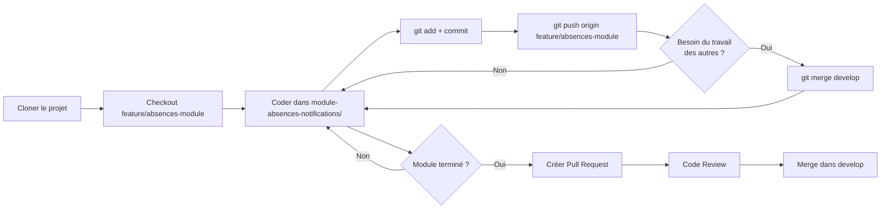

# 🌿 Guide Pratique : Travailler avec les Branches Git

Ce guide explique **concrètement** comment vous et vos 3 collègues allez travailler au quotidien avec Git.

---

## 🎯 Principe de Base

Chaque personne travaille sur **SA branche** et ne touche **QUE son module**. Voici la règle d'or :

```text
Personne 1 → feature/auth-module → module-authentification/
Personne 2 → feature/employes-module → module-employes/
Personne 3 → feature/conges-module → module-conges/
Personne 4 → feature/absences-module → module-absences-notifications/
```

---

## 📅 Scénario Jour 1 : Démarrage

### Vous (Personne 4) - Matin du Jour 1

```powershell
# Vous êtes déjà sur votre branche
git checkout feature/absences-module

# Vérifier que vous êtes bien sur la bonne branche
git branch
# Devrait afficher : * feature/absences-module

# Commencer à travailler dans votre module
cd module-absences-notifications
# Coder, coder, coder...
```

### Vos collègues - Matin du Jour 1

**Personne 1** clone et se place sur sa branche :
```powershell
git clone https://github.com/zal9212/Projet_gestion_RH.git
cd Projet_gestion_RH
git checkout feature/auth-module
# Maintenant il travaille dans module-authentification/
```

```markdown
**Personne 2 et 3** font pareil avec leurs branches respectives.

---
```

## 💼 Scénario : Vous travaillez sur votre module

### Exemple concret : Vous ajoutez une nouvelle API

```powershell
# 1. Vous modifiez des fichiers dans module-absences-notifications/
# Par exemple : AbsenceResource.java

# 2. Vérifier ce qui a changé
git status
# Affiche : modified: module-absences-notifications/src/.../AbsenceResource.java

# 3. Ajouter vos modifications
git add module-absences-notifications/

# 4. Faire un commit avec un message clair
git commit -m "feat: Ajout de l'endpoint GET /api/absences/statistiques"

# 5. Pousser vers GitHub
git push origin feature/absences-module
```

**Résultat** : Vos changements sont sur GitHub, mais **uniquement** sur votre branche. Les autres ne sont pas impactés.

---

## 🔄 Scénario : Récupérer le travail des autres

### Situation : Personne 2 a ajouté une classe utilitaire dans `common/`

Vous voulez utiliser cette classe dans votre module.

```powershell
# 1. Sauvegarder votre travail en cours
git add .
git commit -m "WIP: Travail en cours sur les notifications"

# 2. Aller sur develop pour récupérer les mises à jour
git checkout develop
git pull origin develop
# Télécharge les nouveautés (la classe de Personne 2)

# 3. Retourner sur votre branche
git checkout feature/absences-module

# 4. Fusionner develop dans votre branche
git merge develop
# Maintenant vous avez la classe de Personne 2 !

# 5. Continuer votre travail
# La nouvelle classe est disponible dans common/
```

---

## 🚨 Scénario : Conflit Git (Rare mais possible)

### Situation : Vous et Personne 3 avez modifié le même fichier dans `common/`

```powershell
# Lors du merge, Git vous dit :
# CONFLICT (content): Merge conflict in common/src/.../Utils.java

# 1. Ouvrir le fichier en conflit
# Vous verrez des marqueurs comme :
<<<<<<< HEAD
// Votre code
=======
// Code de Personne 3
>>>>>>> develop

# 2. Choisir quelle version garder (ou fusionner manuellement)
# Supprimer les marqueurs <<<, ===, >>>

# 3. Marquer le conflit comme résolu
git add common/src/.../Utils.java

# 4. Finaliser le merge
git commit -m "Merge develop: Résolution conflit dans Utils.java"

# 5. Pousser
git push origin feature/absences-module
```

**Conseil** : Communiquez avec vos collègues pour éviter de modifier les mêmes fichiers !

---

## 🎉 Scénario : Votre module est terminé

### Vous avez fini votre module Absences & Notifications

```powershell
# 1. Vérifier que tout est commité
git status
# Devrait afficher : nothing to commit, working tree clean

# 2. Synchroniser une dernière fois avec develop
git checkout develop
git pull origin develop
git checkout feature/absences-module
git merge develop

# 3. Pousser votre branche finale
git push origin feature/absences-module

# 4. Aller sur GitHub et créer une Pull Request
# https://github.com/zal9212/Projet_gestion_RH/pulls
# Cliquer "New Pull Request"
# Base: develop ← Compare: feature/absences-module
# Titre: "[Module Absences] Implémentation complète"
# Description: Détailler ce que vous avez fait

# 5. Demander à vos collègues de reviewer
# Ils vont lire votre code et commenter

# 6. Une fois approuvé, merger dans develop
# Cliquer sur "Merge Pull Request" sur GitHub
```

---

## 📊 Visualisation : Flux de Travail Complet



---

## 🛡️ Règles de Sécurité

### ✅ À FAIRE
- Travailler **uniquement** dans votre dossier de module
- Faire des commits **plusieurs fois par jour**
- Synchroniser avec `develop` **tous les matins**
- Tester votre code **avant de pusher**
- Écrire des messages de commit **clairs**

### ❌ À NE JAMAIS FAIRE
- ❌ Modifier les fichiers des autres modules
- ❌ Pusher directement sur `main` ou `develop`
- ❌ Faire un commit géant de 500 fichiers
- ❌ Oublier de pull avant de push
- ❌ Commiter des fichiers `target/` ou `.class`

---

## 🆘 Commandes de Secours

### Annuler des modifications non commitées
```powershell
# Annuler les changements dans un fichier
git checkout -- chemin/vers/fichier.java

# Annuler TOUS les changements non commités
git reset --hard
```

### Revenir en arrière après un commit
```powershell
# Annuler le dernier commit (garde les modifications)
git reset --soft HEAD~1

# Annuler le dernier commit (supprime les modifications)
git reset --hard HEAD~1
```

### Voir l'historique
```powershell
# Historique visuel
git log --oneline --graph --all

# Voir qui a modifié quoi
git blame chemin/vers/fichier.java
```

---

## 📞 Communication avec l'Équipe

### Slack/Discord/WhatsApp
Créez un canal de communication pour :
- Annoncer quand vous pushez des changements importants
- Demander de l'aide en cas de conflit
- Coordonner les modifications dans `common/`

### Exemple de message :
```
🚀 Personne 4 : Je viens de pusher l'API des absences sur feature/absences-module
📦 J'ai ajouté NotificationEvent dans common/ pour le JMS
⚠️ Personne 3, tu peux l'utiliser pour les congés !
```

---

## 🎓 Exemple Complet : Semaine Type

### Lundi Matin
```powershell
git checkout feature/absences-module
git pull origin feature/absences-module
git checkout develop
git pull origin develop
git checkout feature/absences-module
git merge develop
# Commencer à coder
```

### Lundi Après-midi
```powershell
git add module-absences-notifications/
git commit -m "feat: Implémentation de AbsenceService"
git push origin feature/absences-module
```

### Mardi - Jeudi
```powershell
# Répéter : coder → commit → push
# Synchroniser avec develop tous les matins
```

### Vendredi Soir
```powershell
git add .
git commit -m "feat: Finalisation des tests unitaires"
git push origin feature/absences-module
# Créer une Pull Request si le module est terminé
```

---

**Vous êtes maintenant prêt à travailler efficacement en équipe ! 🚀**
